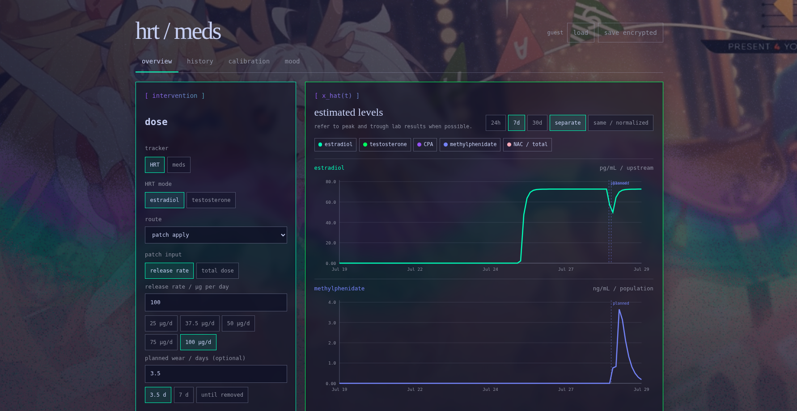

# PEACESIGN!!!!!!!!!!!!!!!!!

*The red sky fading in the distance   
The peace sign burning in a vision from God   
Please help me   *


Tracking HRT, meds, mood and an infovore news aggregator at `peacesign.adiabatic.garden`.

The console is a Vite/React application served by a Cloudflare Worker. D1 will
hold identity, encrypted vault metadata, and shared feed data; R2 will hold
avatars and other bounded object storage. Health records are intended to be
encrypted in the browser before cloud backup.

## Boundaries

- `src/app` composes the application shell and navigation.
- `src/features` contains vertical product domains.
- `src/server` contains Worker routes, jobs, and storage adapters.
- `migrations` contains ordered, non-destructive D1 migrations.
- `content` contains human-maintained inputs such as the curated OPML file.
- `research` will contain reproducible PK fitting work when modeling begins.
- `examples` holds representative visual output, not scratch artifacts.

The health domain is divided by causal role:

- **interventions**: HRT, Concerta, NAC, and other things a user takes or does.
- **observations**: mood, sleep, labs, and subjective effects.
- **models**: estimated latent state such as concentration over time.
- **timeline**: visual joins across the first three categories.

Do not create a shared package or helper until at least two concrete callers
need it. Do not add a generic drug plug-in system before the initial HRT,
Concerta 18 mg, and NAC 600 mg models expose genuine common structure.

## Interface

The interface inherits the public site's `#0f1228` ground, `#c6d0f5` text,
turquoise/green/lavender one-pixel boxes, square corners, and monospace labels.
The DJMAX Respect V wallpaper and a low-speed Paper grain gradient from "shaders.paper.design" provide the
background field. Product language stays short and operational.

## Commands

```sh
corepack enable pnpm
pnpm install

corepack pnpm dev
corepack pnpm check
corepack pnpm build
corepack pnpm worker:dev
```

Deployment
```
pnpm build
npx wrangler deploy
```

Always run build before deploy to generate corresponding /dist folder, which is not tracked by github

## Stages

1. Foundation: buildable Vite application and Worker boundary. ✓
2. Identity: hardened account system — register, login, sessions, idle
   timeout, TOTP, profile/password/delete, D1-backed rate limit, CORS locked
   to the console origin, no plaintext secret fallback. Passkey endpoints
   now active. ✓
3. Vault: fail-closed encrypted backup CRUD, PBKDF2/AES-GCM client crypto (server does not see plaintext unlike upstream hrt tracker.), and
   WebAuthn passkey registration/assertion routes. ✓
4. Health: optional-login local-first HRT/medication interventions, a dedicated
   mood tab, encrypted sync, and a shared timeline. HRT curves use the
   vendored kernel from `https://hrt.mahiro.uk`; NAC calibration follows after
   that.
5. Reading: curated speed dial, then RSS ingestion.

Pause after each stage, verify it, and update this file in the fewest useful
touches.

### Privacy statement

In guest mode, data is saved in localStorage lasting indefinitely until you manually clear browser site data. upon login, information is encrypted via aes-256 prior to sending to a cloudflare server
