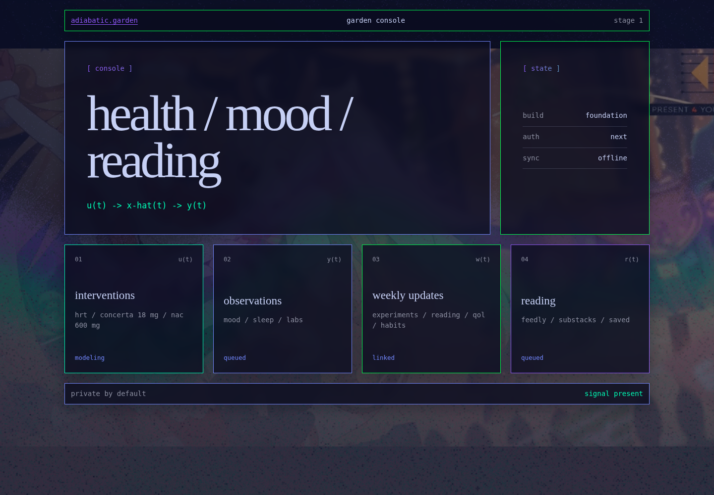
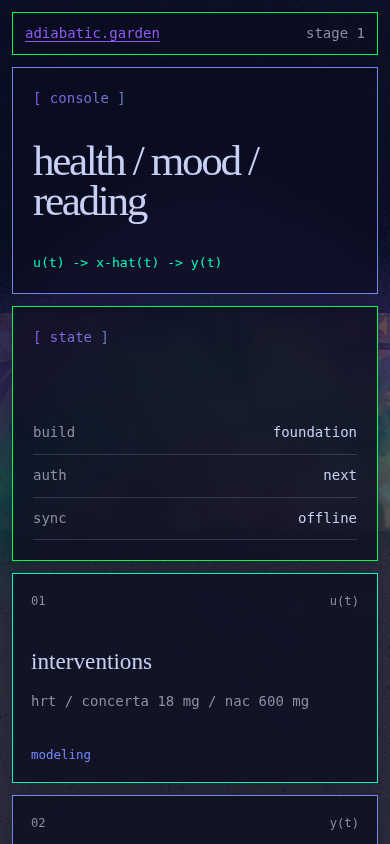

# Examples

Representative visual outputs belong here once models and charts exist. Commit
small SVG, WebP, or PNG examples and embed them in the relevant model README.
Scratch frames remain untracked under `scratch/`.

## Foundation

