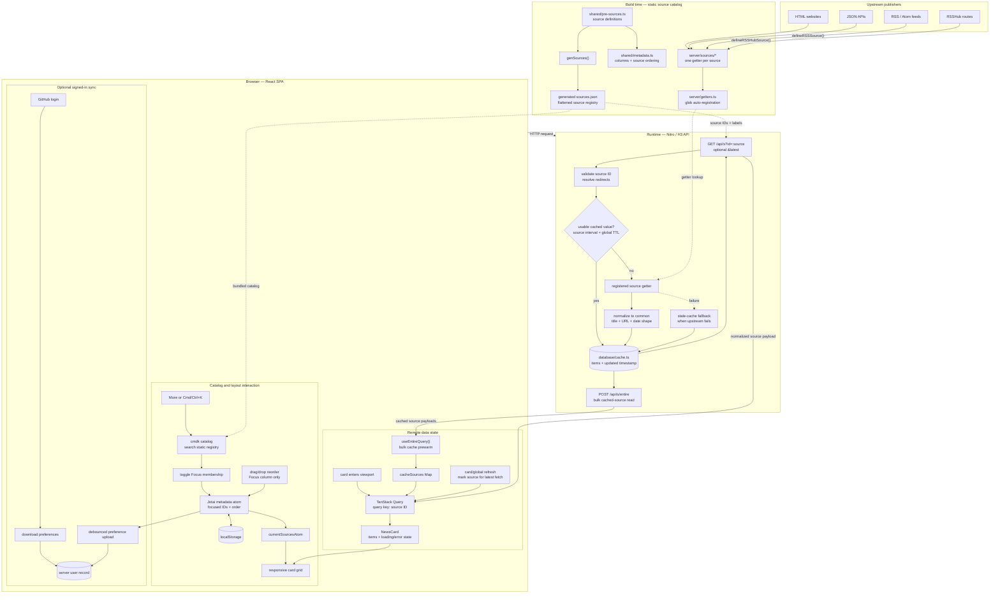

# NewsNow reference dataflow

This diagram documents the NewsNow interaction and information flow that
informs Peacesign's reader. It is a reference architecture, not Peacesign's
implementation contract.

## Reading the diagram

- Source definitions and getter discovery happen at build/startup time. They
  are not a user-editable subscription database.
- `/api/s` checks the cache before invoking a source getter. A request does not
  necessarily scrape or fetch an upstream publisher.
- HTML, JSON API, RSS, Atom, and RSSHub are ingestion strategies used by source
  modules, not three end-user subscription modes.
- TanStack Query runs in the browser. It manages remote data state around API
  calls; the server owns source fetching and persistent cache policy.
- Jotai owns client interaction state such as focused sources and their order.
  That state persists locally and can optionally synchronize after GitHub
  authentication.
- NewsNow is mounted with React `createRoot`, so the server-to-browser boundary
  is asset delivery plus HTTP API traffic rather than React hydration.
- The catalog searches NewsNow's static registry. It does not accept arbitrary
  custom feed URLs.

